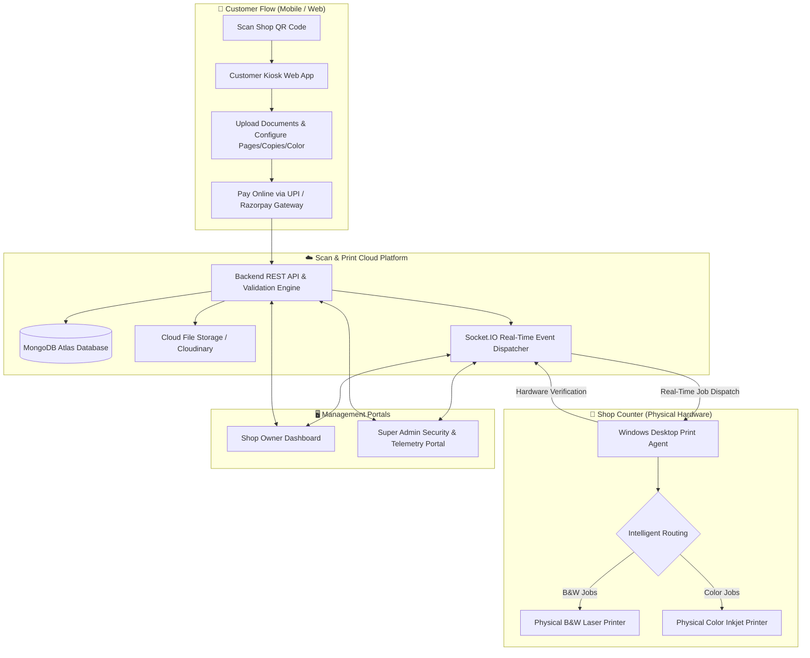

# 🖨️ Scan & Print

> **Automated QR-Based Cloud Printing & Counter PC Hardware Spooling System**  
> `Customer Scans QR → Uploads Document → Configures Print Settings → Pays via UPI → Auto-Printed on Counter PC in Seconds`

[](https://vitejs.dev/)
[](https://tailwindcss.com/)
[%20%2B%20Express-green.svg)](https://nodejs.org/)
[](https://www.mongodb.com/)
[](https://socket.io/)
[](https://www.electronjs.org/)

---

## 📋 Table of Contents

1. [About the Project](#-about-the-project)
2. [Why Scan & Print? (Problems Solved)](#-why-scan--print-problems-solved)
3. [System Architecture](#-system-architecture)
4. [Monorepo Folder Structure](#-monorepo-folder-structure)
5. [Core Features & Modules](#-core-features--modules)
   - [1. Customer Web Kiosk](#1-customer-web-kiosk-kioskshopcode)
   - [2. Shop Owner Portal](#2-shop-owner-portal-owner)
   - [3. Super Admin Portal](#3-super-admin-portal-admin)
   - [4. Desktop Print Agent](#4-desktop-print-agent-windows-electron-app)
   - [5. Production SEO & Static Prerendering](#5-production-seo--static-prerendering)
6. [Tech Stack & Tools](#-tech-stack--tools)
7. [Installation & Local Setup](#-installation--local-setup)
8. [Environment Variables](#-environment-variables)
9. [Core API Endpoints](#-core-api-endpoints)
10. [Socket.IO Real-Time Events](#-socketio-real-time-events)
11. [Hardware Device Binding & Security](#-hardware-device-binding--security)
12. [Production Deployment](#-production-deployment)

---

## 📖 About the Project

**Scan & Print** is an end-to-end cloud printing automation ecosystem designed specifically for Cyber Cafes, Print & Xerox Shops, CSC Centers, Digital Service Points, Universities, and Corporate Desks.

Traditional print shops suffer from constant friction: customers sending files via personal WhatsApp numbers, sharing virus-infected USB flash drives, arguing over pricing, and creating long queues at the counter while the operator manually downloads, opens, configures, and spools each file.

**Scan & Print solves this entirely:**
- Each print shop gets a branded **Counter QR Standee**.
- Customers scan the QR on their smartphones, upload their documents (PDF, Word, Images), select exact print specifications (B&W / Color, Single / Double-sided, Copies, Custom Page Ranges), and pay directly via UPI.
- The cloud server instantly dispatches the job over real-time WebSockets to the shop's **Desktop Print Agent**, which silently routes and spools the file to the connected physical printer in seconds without any manual operator intervention.

---

## ⚡ Why Scan & Print? (Problems Solved)

| Traditional Print Shop Problem | Scan & Print Solution |
| :--- | :--- |
| **Privacy & WhatsApp Spam**: Customers need shop owner's personal number to send files. | Zero phone numbers shared. Direct in-browser upload via QR code. |
| **Malware & Virus Risks**: USB flash drives plugged into counter PCs spread viruses. | Secure sandboxed cloud upload with automated PDF conversion & temporary file purging. |
| **Payment Leakage & Disputes**: Operators forget to collect small change or argue over page counts. | Exact dynamic pricing calculated per page & color mode; upfront automated UPI collection. |
| **Long Counter Queues**: Operator spends 2–4 minutes per customer downloading and opening files. | 100% silent background automated printing directly through local OS spoolers. |
| **Printer Routing Confusion**: Operator accidentally prints B&W jobs on expensive color inkjets. | Intelligent dual-routing: B&W jobs go to B&W laser printers, Color jobs go to Color inkjets. |
| **Credential Sharing & Theft**: Staff copying credentials to run unauthorized shops. | Cryptographic Hardware Device Binding: PC locked to authorized CPU, Motherboard & UUID. |

---

## 🏗️ System Architecture



---

## 📁 Monorepo Folder Structure

```
ScanAndPrint/
├── scanandprint-backend/           # Node.js + Express + Socket.IO REST & Real-Time Engine
│   ├── src/
│   │   ├── configs/                # DB connection, Cloudinary, Environment variables
│   │   │   ├── cloudinary.config.js
│   │   │   ├── db.configs.js
│   │   │   └── env.config.js
│   │   ├── controllers/            # Route controllers
│   │   │   ├── admin.controller.js
│   │   │   ├── agent.controller.js
│   │   │   ├── auth.controller.js
│   │   │   ├── device.controller.js
│   │   │   ├── job.controller.js
│   │   │   ├── kiosk.controller.js
│   │   │   └── upload.controller.js
│   │   ├── middlewares/            # Auth, validation, error handler, Socket Device Guard
│   │   │   ├── auth.middleware.js
│   │   │   ├── error.middleware.js
│   │   │   ├── socketDeviceBinding.middleware.js
│   │   │   ├── upload.middleware.js
│   │   │   └── validate.middleware.js
│   │   ├── models/                 # Mongoose schema models
│   │   │   ├── Admin.model.js
│   │   │   ├── AdminSettings.model.js
│   │   │   ├── Device.model.js
│   │   │   ├── PrintAgent.model.js
│   │   │   ├── PrintJob.model.js
│   │   │   ├── Shop.model.js
│   │   │   └── SubscriptionPayment.model.js
│   │   ├── repositories/          # Data Access Layer (Repository Pattern)
│   │   │   ├── agent.repository.js
│   │   │   ├── device.repository.js
│   │   │   ├── job.repository.js
│   │   │   └── shop.repository.js
│   │   ├── routes/                 # Express REST route definitions
│   │   │   ├── admin.route.js
│   │   │   ├── agent.routes.js
│   │   │   ├── auth.routes.js
│   │   │   ├── device.routes.js
│   │   │   ├── job.routes.js
│   │   │   └── kiosk.routes.js
│   │   ├── services/               # Business logic services
│   │   │   ├── agent.service.js
│   │   │   ├── auth.service.js
│   │   │   ├── job.service.js
│   │   │   ├── kiosk.service.js
│   │   │   └── upload.service.js
│   │   ├── socket.js               # Socket.IO lifecycle & live in-memory registry
│   │   ├── utils/                  # Helper utilities (JWT, Password, ShopCode, PDF, Cloudinary)
│   │   └── index.js                # Server entry point
│   ├── package.json
│   └── .env
│
├── scanandprint-frontend/          # React 19 + Vite 8 + Tailwind CSS v4 Web Client
│   ├── public/                     # Public static assets, sitemap.xml, robots.txt, OG images
│   ├── scripts/
│   │   ├── generate-og-images.js   # Dynamic social preview card generator
│   │   └── generate-seo.js         # Production static HTML prerender & SEO injector
│   ├── src/
│   │   ├── assets/                 # SVGs, icons, and image assets
│   │   ├── components/             # Modular reusable UI components
│   │   │   ├── admin/              # Super Admin charts, metrics, demo timers
│   │   │   ├── common/             # Modals, buttons, badges, accordions
│   │   │   ├── kiosk/              # File upload dropzone, page selector, payment preview
│   │   │   ├── owner/              # QR code downloader, printer selector, job lists
│   │   │   ├── skeleton/           # Custom shimmer & pulse skeleton loading states
│   │   │   └── ui/                 # Core UI building blocks
│   │   ├── data/                   # Static SEO configurations & metadata
│   │   ├── layouts/                # AdminLayout, OwnerLayout, MainLayout
│   │   ├── lib/                    # Axios interceptors, Socket client, Razorpay, PDF tools
│   │   ├── pages/                  # Page views
│   │   │   ├── admin/              # AdminOverview, AdminShops, AdminAgents, AdminDevices, etc.
│   │   │   ├── Home/               # Landing page, Features, Pricing, HowToSetup, Legal
│   │   │   ├── kiosk/              # CustomerKiosk.jsx
│   │   │   └── owner/              # OwnerOverview, OwnerJobs, OwnerPrinters, OwnerDevices, etc.
│   │   ├── store/                  # Zustand global state stores (Auth, Kiosk, Jobs, Admin)
│   │   ├── App.jsx                 # App root & React Router DOM configuration
│   │   └── main.jsx                # DOM mount entry
│   ├── package.json
│   └── vite.config.js
│
└── scanandprint-agent/             # Electron 35 Windows Automated Desktop Print Agent
    ├── assets/                     # App icons (.ico, .png, .svg), tray icons (.png, .svg)
    ├── scripts/                    # Icon rendering scripts
    ├── src/
    │   ├── services/
    │   │   ├── deviceFingerprint.js # SHA-256 hardware signature & physical network IP resolver
    │   │   ├── printerManager.js    # Windows PowerShell printer spooler query
    │   │   ├── printService.js      # pdf-to-printer silent spooling & cloud downloader
    │   │   └── socketService.js     # Real-time WebSocket connection & auto-reconnect
    │   ├── store/
    │   │   └── configStore.js       # AppData JSON storage for credentials & server URL
    │   ├── ui/
    │   │   ├── counter-popup.html   # Real-time counter order alert overlay
    │   │   ├── index.html           # Agent dashboard & setup UI
    │   │   ├── renderer.js          # Client-side UI controller & sound chime triggers
    │   │   └── styles.css           # Modern dark-mode glassmorphic interface
    │   └── utils/
    │       └── pdfConverter.js      # Image-to-PDF standard conversion for direct printing
    ├── main.js                     # Electron main process, tray menu, window manager
    ├── preload.cjs                 # Secure context bridge IPC API
    └── package.json
```

---

## 🎯 Core Features & Modules

### 1. Customer Web Kiosk (`/kiosk/:shopCode`)
- **Zero App Download**: Works directly in any mobile browser (Chrome, Safari, Firefox).
- **Multi-Format Document Upload**: Supports PDF, DOCX, PNG, JPG, and WEBP.
- **Client-Side PDF Page Rendering**: Uses `pdfjs-dist` to render thumbnails and accurately extract page counts.
- **Fine-Grained Print Configuration**:
  - Color mode: Black & White vs Full Color.
  - Page selection: All pages, Odd pages, Even pages, or custom ranges (e.g., `1, 3-5, 8`).
  - Print layout: Single-sided (Simplex) vs Double-sided (Duplex).
  - Copies count with automatic total price recalculation.
- **Seamless UPI / Online Payment**: Razorpay integration with instant Webhook/Socket confirmation.
- **Live Print Status Tracker**: Step-by-step real-time progress bar (`Payment Verified → Spooling → Printed Successfully`).

### 2. Shop Owner Portal (`/owner/...`)
- **Live Overview Dashboard**: Today's revenue, completed prints, ink/paper analytics, and recent transactions.
- **Live Print Job Manager**: Complete history with filters (Completed, Pending, Failed), 1-click **Re-Print**, and job details.
- **Dual Hardware Printer Routing**: Map separate default physical printers for Black & White and Color jobs.
- **Custom QR Standee Generator**: Download high-resolution print-ready counter posters with embedded Shop QR codes.
- **Hardware Device Binding Management (`/owner/devices`)**:
  - Read-only real-time view of the active authorized counter PC.
  - Pending approval notification banner when setting up a new PC.
  - Strict Super Admin security notice preventing unauthorized multi-PC usage.
- **Trial & Plan Management**: Real-time 2-Hour free demo trial countdown timer and 1-click Razorpay subscription renewals.

### 3. Super Admin Portal (`/admin/...`)
- **Platform Analytics & KPI Overview**: Global shops count, daily prints, total GMV revenue, and system trends.
- **Shop Management & Controls**: Search, filter, extend demo trials, grant paid VIP plans, or suspend malicious shops with 1 click.
- **Live Print Agents Monitor (`/admin/agents`)**: Real-time monitoring of all connected desktop agents, live physical IP locations, operating systems, and installed spoolers.
- **Hardware Device Binding Telemetry & Security (`/admin/devices`)**:
  - **Telemetry Grid**: Hostname, CPU Model, Motherboard Serial, System UUID, Real Physical IPv4, and Default Gateway.
  - **Anti-Fraud Guard**: Identifies shops with $\ge 4$ registered machines (credential-sharing detection).
  - **1-Click Authority**: Super Admin `Approve PC`, `Reject`, `Revoke`, or `Re-Approve` actions.
  - **Hardware Telemetry Inspector Modal**: Scrollable viewport inspector with formatted telemetry cards and 1-click raw JSON copy.
- **Financial Ledger & Export**: Searchable transactions log with CSV export capability.
- **Global Settings**: Update platform monthly/yearly subscription rates and trial durations.

### 4. Desktop Print Agent (Windows Electron App)
- **100% Silent Automated Printing**: Automatically downloads verified cloud print orders and routes them to the OS spooler using `pdf-to-printer`.
- **Multi-Signal Hardware Fingerprinting**:
  - Concatenates Machine ID + CPU specifications + Baseboard Serial + System UUID + Hostname/Arch.
  - Generates a deterministic, tamper-proof SHA-256 hardware hash.
- **Accurate Physical Network & Gateway Detection**:
  - Automatically queries active physical adapters (`Wi-Fi` / `Ethernet`).
  - Completely filters out VMware (`VMnet1`, `VMnet8`), VirtualBox, Hyper-V, WSL, and loopback (`127.0.0.1`, `::1`) adapters.
- **Desktop & Background Tray Mode**: Runs minimized in the Windows system tray with auto-startup on boot and desktop shortcut creator.
- **Live Audible Chimes & Counter Overlays**: Plays a sound notification and displays an on-screen order alert when a job arrives.

### 5. Production SEO & Static Prerendering
- Automated build pipeline (`npm run build`) runs `scripts/generate-seo.js`.
- Generates static pre-rendered HTML files for all 12 public marketing routes (`/`, `/pricing`, `/features`, `/how-to-setup`, `/about`, `/contact`, `/privacy-policy`, `/refund-policy`, `/terms-and-conditions`, `/disclaimer`, `/register`, `/shop-login`).
- Injects fully populated OpenGraph (`og:title`, `og:description`, `og:image`), Twitter Cards, Schema.org JSON-LD structured data, dynamic `sitemap.xml`, and `robots.txt` for maximum search engine indexability and WhatsApp/Facebook link previews.

---

## 🛠️ Tech Stack & Tools

### Frontend
- **Framework**: React 19, Vite 8
- **Styling**: Tailwind CSS v4, Custom CSS Animations
- **Routing**: React Router DOM v7
- **Icons**: Lucide React, Boxicons
- **Charts**: Recharts
- **State Management**: Zustand
- **Networking & Real-Time**: Axios, Socket.IO-Client
- **PDF & File Processing**: PDF-Lib, PDF.js, React Dropzone
- **Notifications**: React Hot Toast

### Backend
- **Runtime**: Node.js (ES Modules)
- **Framework**: Express.js
- **Database & ODM**: MongoDB Atlas, Mongoose 9
- **Real-Time Engine**: Socket.IO 4.8
- **Authentication**: JWT (JSON Web Tokens), BCrypt.js
- **Cloud File Storage**: Cloudinary SDK, Multer
- **Payment Gateway**: Razorpay Node SDK
- **Security**: Helmet, CORS, Express Rate Limit

### Desktop Agent
- **Runtime**: Electron 35, Node.js
- **Hardware Telemetry**: `systeminformation`, `node-machine-id`, Node `crypto`
- **Spooling Engine**: `pdf-to-printer`, Windows PowerShell CIM Spooler
- **Storage**: Custom AppData JSON Store

---

## 🚀 Installation & Local Setup

### Prerequisites
- **Node.js**: v18.0.0 or higher
- **MongoDB**: Local MongoDB instance or MongoDB Atlas Connection URI
- **OS**: Windows 10/11 (for Desktop Print Agent testing)

### Step 1: Clone the Repository
```bash
git clone https://github.com/govindkumarjangid/PrintPe.git ScanAndPrint
cd ScanAndPrint
```

### Step 2: Setup Backend Server
```bash
cd scanandprint-backend
npm install

# Create environment configuration file
cp .env.example .env   # Or create .env with required keys

# Start backend in development mode
npm run dev
```
*Backend runs by default on `http://localhost:5000`.*

### Step 3: Setup Frontend Web Client
```bash
cd ../scanandprint-frontend
npm install

# Start Vite frontend dev server
npm run dev
```
*Frontend runs by default on `http://localhost:5173`.*

### Step 4: Setup Desktop Print Agent
```bash
cd ../scanandprint-agent
npm install

# Start Electron Agent in development mode
npm start
```

---

## 🔐 Environment Variables

### Backend (`scanandprint-backend/.env`)
```env
PORT=5000
NODE_ENV=development
MONGO_URI=mongodb+srv://<username>:<password>@cluster.mongodb.net/ScanAndPrintDB?retryWrites=true&w=majority
JWT_SECRET=your_super_secret_jwt_key_here
JWT_EXPIRES_IN=7d

# Frontend Client URL for CORS
CLIENT_URL=http://localhost:5173

# Razorpay Payment Gateway Credentials
RAZORPAY_KEY_ID=rzp_live_your_key_id
RAZORPAY_KEY_SECRET=your_razorpay_secret_key

# Cloudinary Cloud Storage
CLOUDINARY_CLOUD_NAME=your_cloud_name
CLOUDINARY_API_KEY=your_cloudinary_api_key
CLOUDINARY_API_SECRET=your_cloudinary_api_secret

# Default Admin Credentials (Auto-seeded on first launch)
DEFAULT_ADMIN_EMAIL=admin@scanandprint.in
DEFAULT_ADMIN_PASSWORD=AdminPassword123!
```

### Frontend (`scanandprint-frontend/.env`)
```env
VITE_API_URL=http://localhost:5000/api
VITE_SOCKET_URL=http://localhost:5000
VITE_RAZORPAY_KEY_ID=rzp_live_your_key_id
```

---

## 📡 Core API Endpoints

### 1. Customer Kiosk Endpoints
- `GET /api/kiosk/shop/:shopCode` — Retrieve public shop profile, pricing, and live printer online status.
- `POST /api/kiosk/upload` — Upload document and receive page count analysis & price estimate.
- `POST /api/kiosk/order` — Create print order and initiate Razorpay payment order.
- `POST /api/kiosk/verify-payment` — Verify payment signature and trigger real-time print spooling.
- `GET /api/kiosk/job/:jobId/status` — Live status poll for a specific print job.

### 2. Shop Owner Endpoints (Protected by JWT)
- `POST /api/auth/register` — Register a new print shop with 2-Hour free trial or paid plan.
- `POST /api/auth/login` — Authenticate shop owner and issue JWT tokens.
- `GET /api/jobs/my-jobs` — Paginated print job history with status and search filters.
- `POST /api/jobs/:jobId/reprint` — Re-dispatch a previous print job to the agent.
- `GET /api/devices/my-devices` — Retrieve owner's active bound hardware PC and pending requests.
- `POST /api/devices/:deviceId/revoke` — Disconnect/unlink current PC.

### 3. Super Admin Endpoints (Protected by Admin JWT)
- `POST /api/admin/login` — Super Admin authentication.
- `GET /api/admin/stats` — Platform dashboard statistics & KPI telemetry.
- `GET /api/admin/shops` — Paginated list of all shops with action controls (Extend Trial, VIP, Suspend).
- `GET /api/admin/agents` — Real-time list of all connected Desktop Print Agents with live physical IPs.
- `GET /api/admin/devices` — Complete hardware device binding registry (Hostname, CPU, Motherboard Serial, UUID, IP, Gateway).
- `GET /api/admin/devices/suspicious` — Fraud detection query identifying multi-device accounts ($\ge 4$ PCs).
- `POST /api/admin/devices/:deviceId/approve` — Authorize a counter PC for printing.
- `POST /api/admin/devices/:deviceId/reject` — Reject a device connection request.
- `POST /api/admin/devices/:deviceId/revoke` — Revoke authorization from an active machine.

---

## ⚡ Socket.IO Real-Time Events

| Event Name | Direction | Payload & Description |
| :--- | :--- | :--- |
| `AGENT_REGISTER` | Agent $\rightarrow$ Server | Handshake with Shop ID, Secret Key, Hardware Fingerprint, Local IP, Gateway, and installed printers. |
| `AGENT_CONNECTED` | Server $\rightarrow$ Agent | Confirmation that agent is authenticated and live. |
| `PRINT_JOB_DISPATCH` | Server $\rightarrow$ Agent | Dispatches a new verified print order with download URL, color mode, copies, and target printer. |
| `JOB_STATUS_UPDATED` | Agent $\rightarrow$ Server | Updates job progress (`PRINTING`, `PRINTED_SUCCESSFULLY`, `PRINT_FAILED`). |
| `AGENT_STATUS_CHANGE` | Server $\rightarrow$ Portals | Broadcasts live online/offline status, IP, and connected printers to Owner & Admin dashboards. |
| `ADMIN_DEVICE_UPDATED` | Server $\rightarrow$ Admin | Broadcasts real-time hardware telemetry updates to the Super Admin room. |
| `AGENT_KICKED` | Server $\rightarrow$ Agent | Sent when a machine's hardware authorization is revoked by Admin; halts printing immediately. |

---

## 🛡️ Hardware Device Binding & Security

To prevent account abuse, credential sharing, and unauthorized multi-location use:

1. **Deterministic Multi-Signal Hardware Fingerprint**:
   - The Desktop Agent queries the motherboard serial, CPU brand/cores, BIOS UUID, and primary machine ID.
   - Hashes these parameters using SHA-256 into a 64-character persistent signature.
2. **Strict Super Admin Authorization**:
   - When an agent connects on a new machine, it is placed in `PENDING_APPROVAL` status.
   - The Shop Owner cannot self-approve; the request is sent to the **Super Admin Portal** for verification.
   - Once approved by Admin, the Print Agent automatically activates and begins processing jobs without requiring a software restart.
3. **Single Active Device Policy**:
   - Only **1 Physical PC** can be actively authorized per shop at any time.
   - Authorizing a new PC automatically revokes any previous machine and disconnects its active socket session.

---

## 🚢 Production Deployment

### Frontend (Vercel / Netlify)
1. Link repository to Vercel.
2. Set Build Command to: `npm run build`.
3. Set Output Directory to: `dist`.
4. Configure environment variables (`VITE_API_URL`, `VITE_SOCKET_URL`, `VITE_RAZORPAY_KEY_ID`).

### Backend (Render / Railway / AWS EC2)
1. Deploy `scanandprint-backend` as a Node Web Service.
2. Set Start Command: `npm start` (or `node src/index.js`).
3. Set environment variables in dashboard (`MONGO_URI`, `JWT_SECRET`, `CLOUDINARY_*`, `RAZORPAY_*`, `CLIENT_URL`).

### Windows Desktop Agent Installer
1. Inside `scanandprint-agent`:
   ```bash
   npm run dist
   ```
2. Electron-builder will package the application into a standalone Windows `.exe` installer in `dist/`.

---

## 📄 License & Intellectual Property

Copyright © 2026 **Scan & Print**. All rights reserved.  
Built with ❤️ for Indian Cyber Cafes, Print Shops, and Digital Service Centers.